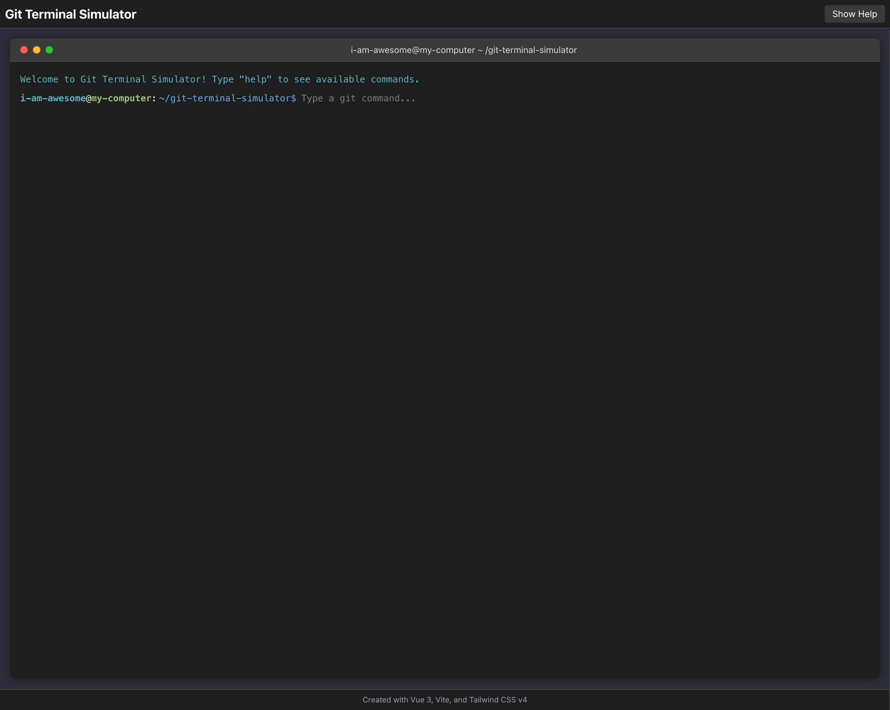

# Git Terminal Simulator

A fun, interactive Git terminal simulator built with Vue 3, Vite, and Tailwind CSS v4. Practice Git commands in a safe, browser-based environment that mimics a unicorn-themed macOS terminal interface.



## ✨ Features

- 🔄 Support for essential Git commands and workflows
- 🌿 Full branch management with proper file tracking per branch
- 🔀 Realistic merge conflict simulation and resolution
- 📝 File creation and editing capabilities
- 🧪 Comprehensive test suite for Git command logic
- 🎨 Modern, responsive UI with Tailwind CSS v4

## 🚀 Getting Started

### Prerequisites

- Node.js (v16 or higher)
- npm or yarn

### Installation

1. Clone the repository:
   ```bash
   git clone https://github.com/devbyray/git-terminal-simulator.git
   cd git-terminal-simulator
   ```

2. Install dependencies:
   ```bash
   npm install
   # or
   yarn install
   ```

3. Start the development server:
   ```bash
   npm run dev
   # or
   yarn dev
   ```

4. Open your browser and navigate to:
   ```
   http://localhost:5173/
   ```

## 🧙‍♂️ Using the Simulator

### Supported Commands

The Git Terminal Simulator supports the following commands:

```bash
# Repository operations
git init                      # Initialize a new Git repository
git status                    # Show the working tree status
git log                       # Show commit logs
git help                      # Show help information

# Staging & committing
git add <file>                # Add file contents to the index
git add .                     # Add all files to the index
git commit -m "message"       # Record changes to the repository

# Branch management
git branch                    # List all branches
git branch <name>             # Create a new branch
git checkout <branch>         # Switch to existing branch
git checkout -b <name>        # Create and switch to a new branch
git switch <branch>           # Switch to existing branch
git switch -c <name>          # Create and switch to a new branch
git merge <branch>            # Merge a branch into your current branch

# File operations
ls                            # List files in the current directory
touch <file>                  # Create a new file
edit <file> <content>         # Edit file content
cat <file>                    # View file content

# Terminal operations
help                          # Show help information
clear                         # Clear the terminal
```

## 👨‍🏫 Teaching with Git Terminal Simulator

The Git Terminal Simulator is designed to be an effective teaching tool for Git concepts. Here's how you can use it in educational settings:

### For Instructors

#### 1. Live Demonstrations
Use the simulator during presentations to demonstrate Git commands and workflows without worrying about setup or environment issues. The simulator provides a consistent experience across all platforms.

#### 2. Step-by-Step Exercises
Create guided exercises for students to follow along:

**Example: Basic Git Workflow Exercise**
1. Initialize a repository with `git init`
2. Create a file with `touch README.md`
3. Add content with `edit README.md This is my first file`
4. Stage the file with `git add README.md`
5. Commit the changes with `git commit -m "Initial commit"`
6. View the commit history with `git log`

#### 3. Merge Conflict Training
One of the most challenging aspects of Git for beginners is handling merge conflicts. Use the simulator to:

1. Create branches with `git branch feature` and `git switch feature`
2. Make different changes to the same file in different branches
3. Attempt to merge with `git merge feature`
4. Show how to resolve conflicts by:
   - Viewing the conflict with `cat <file>`
   - Editing the file to resolve conflicts
   - Staging the resolved file with `git add <file>`
   - Completing the merge with `git commit`

#### 4. Sample Teaching Modules

**Module 1: Git Basics (45-60 minutes)**
- Repository initialization
- Making changes and committing
- Viewing history

**Module 2: Branching and Merging (60-90 minutes)**
- Creating and switching branches
- Making changes in different branches
- Merging changes
- Resolving conflicts

**Module 3: Git Workflows (90-120 minutes)**
- Feature branch workflow
- Git Flow introduction
- Pull request simulation

### For Learners

#### Self-Guided Practice

1. **Start with the basics**: Initialize a repository, create files, and make commits.
   ```bash
   git init
   touch README.md
   edit README.md "# My Project"
   git add README.md
   git commit -m "Initial commit"
   ```

2. **Practice branching**: Create multiple branches and switch between them.
   ```bash
   git branch feature
   git switch feature
   # or
   git switch -c feature2  # Create and switch in one command
   ```

3. **Create merge conflicts intentionally**: This is a safe environment to practice handling conflicts.
   ```bash
   # In main branch
   edit README.md "# Main branch content"
   git add README.md
   git commit -m "Update in main"
   
   # Switch to feature branch
   git switch feature
   
   # Make conflicting changes
   edit README.md "# Feature branch content"
   git add README.md
   git commit -m "Update in feature"
   
   # Try to merge (will create conflict)
   git switch main
   git merge feature
   
   # Resolve the conflict
   cat README.md  # View the conflict
   edit README.md "# Resolved content"
   git add README.md
   git commit -m "Resolve merge conflict"
   ```

#### Learning Path

1. **Git Fundamentals**
   - Repository initialization
   - Basic commit workflow
   - Viewing history

2. **Branching**
   - Creating branches
   - Switching between branches
   - Merging branches

3. **Advanced Topics**
   - Handling merge conflicts
   - Branch management strategies
   - Best practices for commits and messages

## 🤝 Contributing

Contributions are welcome! Here's how you can contribute:

1. Fork the repository
2. Create a feature branch (`git checkout -b feature/amazing-feature`)
3. Commit your changes (`git commit -m 'Add some amazing feature'`)
4. Push to the branch (`git push origin feature/amazing-feature`)
5. Open a Pull Request

### Development

The project uses Vue 3 with the Composition API and Vite as the build tool. The main components are:

- `TerminalContainer.vue`: Main container for the terminal interface
- `TerminalInput.vue`: Handles user input
- `TerminalOutput.vue`: Displays command outputs
- `FormattedHelpOutput.vue`: Displays formatted help content
- `useGitCommands.js`: Core logic for Git command processing

### Project Structure

```
git-terminal-simulator/
├── public/              # Static assets
├── src/                 # Source files
│   ├── components/      # Vue components
│   ├── composables/     # Vue composables (including useGitCommands.js)
│   ├── App.vue          # Main application component
│   ├── main.js          # Application entry point
│   └── style.css        # Global styles
├── tests/               # Test files
├── index.html           # HTML entry point
├── package.json         # Dependencies and scripts
├── tailwind.config.js   # Tailwind CSS configuration
└── vite.config.js       # Vite configuration
```

### Running Tests

```bash
npm test
# or
yarn test
```

## 📝 Future Enhancements

- Support for remote repository operations (clone, push, pull)
- Visual representation of the Git commit graph
- More advanced Git commands (rebase, cherry-pick, etc.)
- Customizable terminal themes
- Shareable scenarios for teaching specific Git concepts

## 📜 License

This project is licensed under the [European Union Public Licence (EUPL)](../LICENSE) - see the LICENSE file for details.

## 🙏 Acknowledgments

- Inspired by the macOS Terminal interface
- Built with [Vue 3](https://vuejs.org/), [Vite](https://vitejs.dev/), and [Tailwind CSS v4](https://tailwindcss.com/)
- Special thanks to all contributors and the Git community
